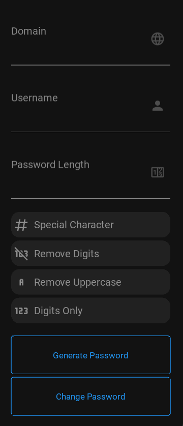

# KitPass

KitPass is a 100% open-source password manager designed to ensure the security and privacy of your data. All information is stored locally on your device, and the app operates entirely offline for complete peace of mind.

## Table of Contents

- [Introduction](#introduction)
- [Features](#features)
- [Screenshot](#screenshot)
- [Packaging](#packaging)
  - [For Android](#packaging-for-android)
  - [For Windows](#packaging-for-windows)
- [Roadmap](#roadmap)
- [Contribution](#contribution)
- [License](#license)

## Introduction

KitPass was created to address growing concerns about the security of personal data. Unlike many password managers that rely on cloud servers, KitPass ensures that all your sensitive information remains on your device, accessible only to you.

## Features

- **Offline storage**: KitPass works entirely offline, meaning no data is ever sent to external servers or stored in the cloud.
- **Local encryption**: All passwords are securely stored on your device, encrypted with industry-standard algorithms.
- **Data export and import**: Easily back up or restore your data locally for maximum security.
- **Easy to use**: An intuitive, lightweight interface for quick and secure access to your information.

## Screenshot


*Illustration of the KitPass interface*

## Packaging

### Packaging for Android

KitPass can be packaged for Android using Buildozer.

1. **Install necessary dependencies:**

    ```bash
    sudo apt update
    sudo apt install -y git zip unzip openjdk-17-jdk python3-pip autoconf libtool pkg-config zlib1g-dev libncurses5-dev libncursesw5-dev libtinfo5 cmake libffi-dev libssl-dev
    pip3 install --user --upgrade Cython==0.29.33 virtualenv KivyMD==1.1.1
    ```

2. **Clone and install Buildozer:**

    ```bash
    git clone https://github.com/kivy/buildozer
    cd buildozer
    python setup.py build
    pip install -e .
    cd ..
    ```

3. **Create an Android package (Debug):**

    ```bash
    cd specs
    cd android
    buildozer -v android debug
    ```

4. **Create an Android package (Release):**

    ```bash
    cd specs
    cd android
    buildozer android release
    ```

5. **Debugging on Android with ADB:**

   To view live logs when testing on an Android device, use the command:

    ```bash
    adb logcat
    ```

### Packaging for Windows

To create an executable for Windows, PyInstaller is used with a `.spec` file.

1. **Create the Windows executable:**

    ```bash
    pyinstaller specs/windows/Kitpass.spec
    ```

This will generate an executable you can use for installation on Windows systems.

## Roadmap

The roadmap for KitPass outlines the future features and improvements planned for the project. You can view the upcoming goals and milestones to better understand the evolution of the app.  
Check out the full roadmap [here](ROADMAP.md).

## Contribution

KitPass is an open-source project, and contributions are welcome! If you have feature ideas, bug reports, or just want to help improve the project, feel free to open an issue or submit a pull request on our GitHub repository.  
For more details on how to contribute, please refer to our contribution guidelines.  
Start contributing by visiting the contribution file [here](CONTRIBUTING.md).

## License

KitPass is distributed under the GPL-3.0 license.  
This project uses the [cryptography](https://cryptography.io/) library under the [Apache 2.0](https://github.com/pyca/cryptography/blob/main/LICENSE.APACHE) license.